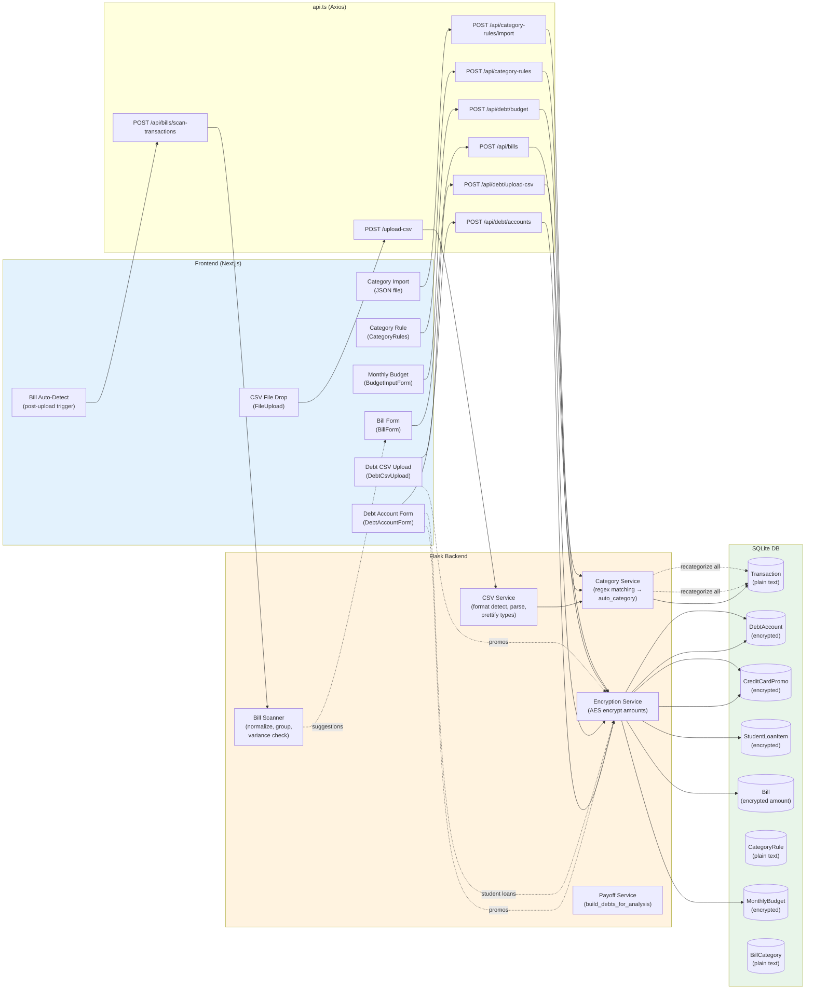
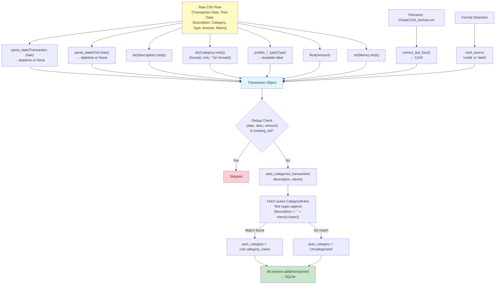

# Data Ingestion Flow

How data enters the budgeting app, what transformations it undergoes, and where it lands.

## Chart 1: CSV Transaction Upload (Primary Ingestion Path)

The most complex flow — file upload through format detection, parsing, deduplication, auto-categorization, DB storage, and the post-upload bill scan trigger.

```mermaid
flowchart TD
    A["User drops CSV file"] --> B["FileUpload.tsx\n(react-dropzone, max 16MB)"]
    B --> C["api.ts → uploadCsv(file)\nPOST /api/upload-csv\n(FormData, multipart)"]
    C --> D["transactions.py\nupload_csv()"]

    D --> E{"Validate file\n(.csv extension)"}
    E -- Invalid --> E1["400 Error"]
    E -- Valid --> F["extract_last_four(filename)\nRegex: Chase(\\d{4})"]

    F --> G["Save to temp file\n(UUID prefix)"]
    G --> H["pd.read_csv()\n(pandas DataFrame)"]

    H --> I{"detect_csv_format(df)\nMatch column headers"}
    I -- "format1\n(credit card)" --> J["process_csv_format1(df)\ncard_source = 'credit'"]
    I -- "format2\n(debit/checking)" --> K["process_csv_format2(df)\ncard_source = 'debit'"]

    J --> J1["parse_date() → transaction_date, post_date"]
    J1 --> J2["prettify_credit_type()\n→ Title case"]
    J2 --> J3["Set: category from CSV,\nmemo from Memo column"]

    K --> K1["parse_date() → transaction_date\n(post_date = same)"]
    K1 --> K2["prettify_debit_type()\n→ DEBIT_TYPE_LABELS mapping"]
    K2 --> K3["Set: category = '',\nmemo from Details,\nbalance, check_number"]

    J3 --> L["List of Transaction objects"]
    K3 --> L

    L --> M["Query existing transactions\nin date range"]
    M --> N{"For each transaction:\nDedup check\n(date + desc + amount)"}
    N -- Duplicate --> O["Skip, increment\nduplicate_count"]
    N -- New --> P["auto_categorize_transaction()\n→ CategoryRule regex matching"]
    P --> Q["Set auto_category\n(first match or 'Uncategorized')"]
    Q --> R["db.session.add()"]

    R --> S["db.session.commit()\nCleanup temp file"]
    O --> S
    S --> T["Response:\nsaved_count, duplicate_count,\nformat_detected, total_rows"]

    T --> U["Frontend reloads:\nloadTransactions()\nloadStats()\nloadFilterOptions()"]
    U --> V["scanForBills()\nPOST /api/bills/scan-transactions"]

    V --> W["Query expenses\n(amount < 0, last 6 months)"]
    W --> X["Normalize descriptions\n(lowercase, strip refs/dates)"]
    X --> Y["Group by normalized key\nFilter: 3+ months, ≤20% variance"]
    Y --> Z["Return bill suggestions\nwith confidence scores"]
    Z --> Z1["BillsPanel shows suggestions\nUser can accept → BillForm"]

    style A fill:#e1f5fe
    style E1 fill:#ffcdd2
    style S fill:#c8e6c9
    style Z1 fill:#fff9c4
```

## Chart 2: All Data Ingestion Paths (Overview)

Every way data enters the system — manual forms, CSV uploads, imports — and what transformations/storage each path hits.

## Chart 3: Single CSV Row Transformation

What happens to one CSV row — every field transformation, the dedup check, and the category rule matching.

---

## Suggestions for Improving Data Flow Visibility

### 1. Missing ingestion path: Manual Category Override

`manual_category` exists on the Transaction model and is respected everywhere (display, stats, recategorization skips it), but **there is no API endpoint to set it**. Users can't override auto-categorization from the UI.

**Recommendation**: Add `PATCH /api/transactions/{id}` to set `manual_category`, and an inline edit UI in `TransactionTable`.

### 2. No data transformation audit trail

When a CSV is uploaded, there's no record of:
- Which file was uploaded and when
- How many rows were deduplicated vs. saved
- Which category rules matched which transactions
- What the original raw values were before prettification

**Recommendation**: Add an `UploadLog` model (`filename`, `format`, `rows_total`, `rows_saved`, `rows_duplicate`, `uploaded_at`) and optionally a `CategoryMatchLog` linking transactions to the rule that categorized them. This makes debugging mis-categorizations much easier.

### 3. Silent deduplication with no visibility

Duplicates are silently skipped. If a user re-uploads the same file, they get a count but can't see *which* transactions were duplicates or why.

**Recommendation**: Return the list of duplicate transaction descriptions (or first N) in the upload response. Optionally show them in a collapsible section in the upload success message.

### 4. Debt CSV hardcodes account_type to 'credit_card'

The debt CSV upload (`POST /api/debt/upload-csv`) sets `account_type='credit_card'` for all rows. Users uploading mixed debt types would get incorrect classifications.

**Recommendation**: Either add an `Account Type` column to the CSV format, or let users select the type before upload.

### 5. Bill scan runs silently with no feedback on zero results

`scanForBills()` fires after every CSV upload but the user doesn't know it ran unless suggestions appear. No indication that the scan completed with zero new suggestions.

**Recommendation**: Surface a brief toast/notification: "Scanned for recurring bills — found N new suggestions" (even when N=0).

### 6. No data flow logging on the backend

There are `print()` statements for debug but no structured logging. If something goes wrong during ingestion, there's no trail to investigate.

**Recommendation**: Replace `print()` with Python `logging` module. Log at key touchpoints: format detected, rows parsed, dedup results, category rules applied, encryption operations. This is the single highest-impact improvement for observability.

### 7. Recategorization is all-or-nothing

When a category rule is created/updated, `recategorize_all_transactions()` scans every transaction in the DB. No visibility into how many were changed or which ones.

**Recommendation**: Return a list of affected transaction IDs/descriptions in the API response, not just a count. Consider making this operation confirmable (preview changes before applying).
